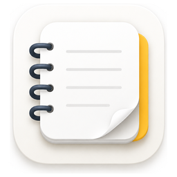

<div align="center">
  
  <h1>Noto</h1>
  <p><strong>极简 · 优雅 · 个性</strong></p>
  <p>原生 macOS 笔记应用 · 适配 Apple Silicon</p>

  <p>
    
    
    
    
    
  </p>
</div>

---

## 📖 简介

**Noto** 是一款为 macOS 原生打造的笔记应用。简洁优雅的界面、流畅的编辑体验、强大的自定义主题系统，以及 Touch ID 指纹解锁保护，让你随时随地记录灵感。

## ✨ 功能特性

### 📝 富文本编辑器
| 功能 | 说明 |
|------|------|
| **文字样式** | 粗体、斜体、下划线、删除线 |
| **对齐方式** | 左对齐、居中、右对齐、两端对齐 |
| **字号/行距** | 增大/减小字号、循环切换行距 |
| **缩进控制** | 增加/减少段落缩进 |
| **列表** | 无序列表、有序列表、待办复选框 ☐ |
| **字体颜色** | 预设 9 色彩盘 |
| **背景高亮** | **16 种高亮颜色**选择器 |
| **Markdown 模式** | 一键切换，支持标题/粗体/斜体/链接/代码 |
| **拖拽导入** | 直接拖入图片/PDF/文本/网页到编辑器 |
| **引用块/代码块** | 一键切换引用和等宽代码样式 |
| **超链接/图片/分割线** | 插入链接、图片、水平分隔线 |
| **清除格式** | 一键还原为纯文本 |

### 🎨 主题系统
- **6 套预设主题**：浅色、深色、羊皮纸、午夜、森林、海洋
- **自定义主题**：自由搭配背景色、文字色、强调色、卡片色
- **背景纹理**：9 种纹理效果
- **字体配置**：自定义字族、字号、字重、行间距

### 🌗 暗色模式
- **三种模式**：跟随系统 · 始终浅色 · 始终深色

### 🔒 隐私文件夹 + Touch ID
- **密码保护**：SHA256 + 随机盐值加密
- **指纹解锁**：支持 Touch ID / Face ID
- **安全机制**：修改/移除密码需验证旧密码
- **内容隐藏**：锁定文件夹的笔记自动隐藏

### 📋 排序 & 批量操作
- **多种排序**：编辑时间、创建时间、标题
- **批量操作**：勾选多篇笔记 → 删除/移动/置顶

### ☁️ iCloud 同步
- 数据存储在 iCloud Drive，多设备自动同步
- 无需开发者账号，支持本地 ↔ iCloud 迁移

### 🗑️ 回收站自动清理
- 软删除机制，笔记先移入回收站
- **自动清理**：自定义保留天数（7/15/30/60/90天）
- 超出时间后自动永久删除

## 🚀 快速开始

### 直接使用
1. 从 [Releases](https://github.com/kail896/Noto/releases) 下载最新的 `Noto.dmg`
2. 打开 DMG，将 `Noto.app` 拖入 `Applications` 文件夹
3. 首次打开可能需要右键 → 打开（Gatekeeper 提示）

### 从源码构建
```bash
git clone https://github.com/kail896/Noto.git
cd Noto
swift build -c release
bash build.sh
```

构建产物位于 `.build/Noto.dmg`。

## 🏗️ 技术架构

| 层级 | 技术 |
|------|------|
| **UI 框架** | SwiftUI 7 (macOS 15+) |
| **富文本** | NSTextView (NSViewRepresentable) |
| **持久化** | JSON 文件 (Codable) |
| **密码学** | CryptoKit (SHA256) |
| **存储** | Application Support / iCloud Drive |
| **图标生成** | Python (Pillow) → iconutil |
| **签名** | Ad-hoc codesign |

## 📁 项目结构
```
Noto/
├── Package.swift              # SwiftPM 配置
├── build.sh                   # 构建 & DMG 打包脚本
├── generate_icon.py           # 应用图标生成器（已移除）
├── Resources/
│   ├── Info.plist             # 应用配置
│   └── Noto.icns              # 应用图标
└── Sources/Noto/
    ├── NotoApp.swift           # 应用入口
    ├── Models/
    │   ├── NoteModel.swift     # 笔记 & 文件夹模型
    │   ├── ThemeTypes.swift    # 主题类型定义
    │   └── ThemeModel.swift    # 主题渲染
    ├── ViewModels/
    │   └── AppState.swift      # 全局状态管理
    └── Views/
        ├── ContentView.swift   # 三栏主布局
        ├── SidebarView.swift   # 侧边栏
        ├── NoteListView.swift  # 笔记列表
        ├── NoteEditorView.swift # 富文本编辑器
        ├── LockScreenView.swift # 密码锁
        ├── ThemeEditorView.swift # 主题编辑器
        └── SettingsView.swift  # 设置页面
```

## 🖥️ 系统要求

- **macOS** 15.0 Sequoia 或更高
- **芯片** Apple Silicon（M 系列）或 Intel
- **存储** 约 10MB（不含用户数据）
- **iCloud**（可选）用于多设备同步

## 📄 许可证

本项目采用 MIT 许可证。详见 [LICENSE](LICENSE) 文件。
